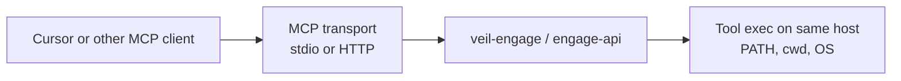

# Engage MCP topology (client-native execution)

Veil Engage exposes MCP so a client (for example Cursor or Claude Desktop) can invoke cataloged tools. **MCP is a control channel, not a remote execution bridge for arbitrary host binaries.**

## Where tools actually run

MCP tool handlers resolve to local subprocess execution in the **same operating-system process tree** as the MCP server implementation (`veil-engage` for stdio MCP, or `engage-api` when MCP is served over HTTP). Calls such as `exec.Command` / `subprocess` use **that host’s environment**, including **`PATH` on that machine**—not the analyst’s laptop unless the MCP server process is running on the laptop.

## Anti-pattern

**Remote Engage server + scanners or pentest binaries only on the analyst laptop** does **not** work with standard MCP: the protocol does not ship your local `nmap`, `masscan`, or custom scripts to the remote host. Without a **separate agent or RPC layer on the laptop** (out of scope for default MCP), tools must be present **on the host where Engage runs**, or invocations will fail or hit stubs.

For the full phased rollout and invariants, see the master plan: [.cursor/plans/engage_mcp_client_native_execution_master.plan.md](../.cursor/plans/engage_mcp_client_native_execution_master.plan.md).

Dependency checklist for the execution host (planned in P1): [docs/engage/engage-client-dependencies.md](engage-client-dependencies.md) *(upcoming after P1 merge; path reserved for the client-native contract).*
