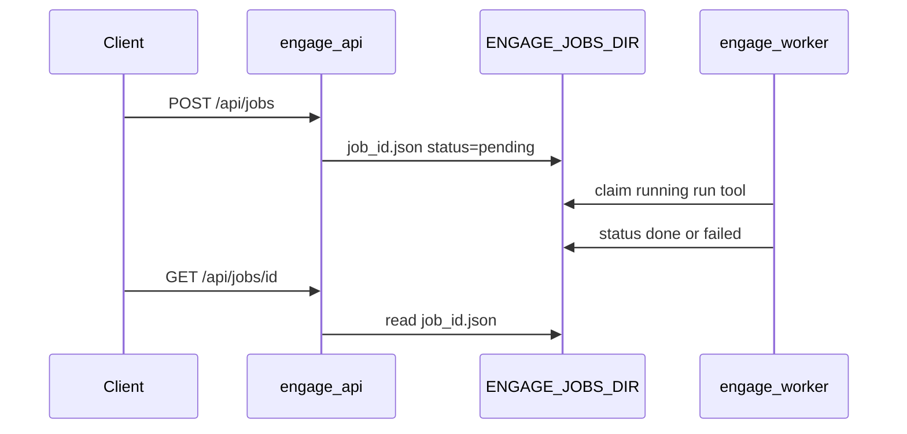

# Engage runtime

**Engage** is the fourth Veil layer: authorized offensive security tooling, workflows, and reports. It is separate from the graph read path.

**Ports (dev):** engage-api **8890**, engage-mcp HTTP **8892**, secure nginx **8443**. Graph stack ports (8090/8091/7474/7687) are in [threatintel-runtime.md](../architecture/threatintel-runtime.md). Quick start: [README.md](../README.md#quick-start) · compose: [deploy/engage/README.md](../deploy/engage/README.md).

## Threat model

| Risk | Mitigation |
|------|------------|
| Unauthenticated tool execution | Keycloak JWT, `VEIL_REQUIRE_AUTH`, nginx TLS |
| Collateral damage / illegal use | Lab/VPN only; RBAC roles `veil-engage-runner`, `veil-engage-admin` |
| Graph exfiltration via engage | Engage uses veil-api with service account (`veil-reader`), not direct Neo4j |

## Environment

| Variable | Default | Role |
|----------|---------|------|
| `ENGAGE_API_LISTEN` | `:8890` | API bind |
| `ENGAGE_CATALOG_PATH` | `catalog/tools.yaml` | Base catalog path (see merge below) |
| `ENGAGE_RUNNER_WORKDIR` | `/tmp/engage` | Subprocess cwd |
| `ENGAGE_EXECUTION_PROFILE` | `client-native` | `client-native` (default in base [compose.yml](../deploy/engage/compose.yml)) validates that `ENGAGE_RUNNER_MODE` is unset/`local` and `ENGAGE_RUNNER_CONTAINER` is empty. `docker-exec` opts into docker runner (set only in [compose.runner.yml](../deploy/engage/compose.runner.yml) / CI runner overlays). |
| `ENGAGE_RUNNER_MODE` | `local` | `local` or `docker` (exec in `engage-runner` container when profile is `docker-exec`) |
| `ENGAGE_RUNNER_CONTAINER` | — | Container name when `ENGAGE_RUNNER_MODE=docker` |
| `ENGAGE_PATH_EXTRA` | — | Optional colon-separated directories **prepended** to subprocess `PATH` for catalog tools ([pkg/exec](../pkg/exec/executor.go) `mergeEngagePathExtra`). |
| `ENGAGE_VEIL_API_URL` | `http://localhost:8090` | Graph read API |
| `ENGAGE_VEIL_CLIENT_ID` / `SECRET` / `TOKEN_URL` | — | OAuth2 client credentials; **omit all three** for local/dev stacks without Keycloak — `veilgraph` client calls veil-api without `Authorization` |
| `AUTH_ENABLED` | `0` | Keycloak JWT |
| `ENGAGE_JOBS_MODE` | `memory` | `memory` (API runs jobs in-process) or `file` (worker polls shared dir) |
| `ENGAGE_JOBS_DIR` | `/tmp/engage/jobs` | JSON job files when `ENGAGE_JOBS_MODE=file` |
| `ENGAGE_JOBS_POLL_SEC` | `1` | Worker poll interval (file mode) |
| `ENGAGE_WORKER_CONCURRENCY` | `2` | Async job queue workers (`ENGAGE_JOBS_MODE` redis/nats/file) |
| `ENGAGE_MAX_PARALLEL` | `5` | Max concurrent catalog tools in sync smart-scan / bugbounty execute / parallel attack chain (cap 32) |
| `ENGAGE_ALLOW_RAW_COMMAND` | `0` | Lab only: allow any binary in `POST /api/command` (ignored when prod or `ENGAGE_DENY_RAW_COMMAND=1`) |
| `ENGAGE_DENY_RAW_COMMAND` | `0` | Set `1` in secure profile to force catalog allowlist |
| `ENGAGE_ENV` | `local` | `prod` disables raw commands via `SecurityConfig` |
| `ENGAGE_METRICS_ENABLED` | `0` | Expose Prometheus `GET /metrics` |
| `ENGAGE_AUDIT_WEBHOOK_URL` | — | Optional audit batch POST target |
| `ENGAGE_AUDIT_WEBHOOK_SECRET` | — | HMAC secret for `X-Engage-Signature` |
| `ENGAGE_AUDIT_DIR` | `/var/veil/engage/audit` | JSONL audit log |
| `ENGAGE_AUDIT_POSTGRES_URL` | — | Optional Postgres audit mirror + retention |
| `ENGAGE_AUDIT_RETENTION_DAYS` | `0` | Prune Postgres rows older than N days (when URL set) |
| `ENGAGE_EVENTS_NATS_ENABLED` | `0` | Publish audit events to NATS (`engage.events.audit`) |
| `ENGAGE_PLAYBOOKS_PATH` | — | Override bug bounty playbook YAML |
| `ENGAGE_PDF_ENGINE` | `gofpdf` | `wkhtml` uses `wkhtmltopdf` for PDF export |
| Pipeline engage bridge | `pipeline/engage-events` | Consumes `engage.events.>` → `ingest.engage.tool_run` / `ingest.engage.finding` |
| Graph ingest (engage) | `knowledge/ingest` `SourceEngage` | Persists `EngageToolRun` / `EngageFinding` in Neo4j (`GRAPH_PACK_VERSION` ≥ v0.4.3) |

### Catalog merge (live tools)

At startup, **InitAPI** merges YAML in order (later overrides): `tools.yaml` → `tools.live.yaml` → `tools.enabled.yaml`. Runner profile may set `ENGAGE_CATALOG_PATH=tools.live.yaml` directly ([compose.runner.yml](../deploy/engage/compose.runner.yml)). Regenerate live set: `python3 scripts/engage/generate-tools-live.py` (**113** enabled). Details: [engage-tools.md](engage-tools.md).

### Async jobs (API + worker)



| Mode | Executor | Use case |
|------|----------|----------|
| `memory` | `engage-api` goroutine | Local dev, unit tests |
| `file` | `engage-worker` | Compose (`engage_jobs` volume shared with API) |

## Compose

```bash
docker compose -f deploy/engage/compose.yml up -d --build engage-api
curl -sS http://localhost:8890/health | jq .
```

Secure overlay: `deploy/engage/compose.secure.yml` + `deploy/profiles/secure-engage.env` (`ENGAGE_ENV=prod`, `ENGAGE_DENY_RAW_COMMAND=1`, `VEIL_REQUIRE_AUTH=1`).

| Variable | Lab | Secure (`compose.secure.yml`) |
|----------|-----|-------------------------------|
| `ENGAGE_ALLOW_RAW_COMMAND` | optional `1` | ignored (denied) |
| `VEIL_REQUIRE_AUTH` | optional | `1` via profile |

### Runner profile (docker exec, legacy lab/CI only)

Default path is `ENGAGE_EXECUTION_PROFILE=client-native` (host `PATH`, no runner container). Docker-exec overlay, compose commands, and image tiers: [deploy/engage/README.md](../deploy/engage/README.md). **Root-equivalent** when mounting the Docker socket — lab/VPN only.

Tool execution smoke (opt-in): `make test-engage-smoke-tool` or `ENGAGE_SKIP_TOOL_SMOKE=1` in CI without Docker.

### Events bus e2e (NATS → ingest)

**Prerequisites:** Docker daemon; ports `4222`, `7687`, `8890` free; ~4–8 GB RAM for Neo4j + builds.

```bash
make test-engage-events-pipeline
```

The smoke script uses profile `graph-ingest` with `compose.events.yml`, polls Neo4j until `EngageToolRun` count ≥ 1, and fails fast with service logs on timeout. Tool POST may return `success: false` (no scanner in API image); audit events still flow when `ENGAGE_EVENTS_NATS_ENABLED=1`.

| Env | Default | Role |
|-----|---------|------|
| `SMOKE_EVENTS_API_WAIT_SEC` | 120 | Wait for `engage-api` `/health` |
| `SMOKE_EVENTS_NEO4J_WAIT_SEC` | 90 | Wait for Neo4j cypher-shell |
| `SMOKE_EVENTS_INGEST_POLL_SEC` | 60 | Poll `EngageToolRun` after tool POST |

Required engage-api env (via `compose.events.yml`): `ENGAGE_EVENTS_NATS_ENABLED=1`, `ENGAGE_NATS_URL=nats://nats:4222`. NATS must be **healthy** before API starts (`depends_on`).

Manual stack:

```bash
docker compose -f deploy/engage/compose.yml -f deploy/engage/compose.events.yml \
  --profile graph-ingest up -d --build \
  nats neo4j engage-api engage-events-worker ingest_worker
```

Smart-scan findings publish to `engage.events.finding` when `ENGAGE_EVENTS_NATS_ENABLED=1`; the bridge maps them to `ingest.engage.finding`.

### Full Veil + engage stack (shared NATS)

Use **either** standalone `compose.events.yml` (bundled NATS) **or** the veil-stack overlay — do not combine both.

```bash
./scripts/ops/compose-up-veil-engage.sh
./scripts/test/smoke-veil-engage-stack.sh
# Manual (stack must already be up):
make test-engage-veil-stack
# CI / self-contained:
make test-engage-veil-stack-ci
```

| Env | Default | Role |
|-----|---------|------|
| `SMOKE_VEIL_API_WAIT_SEC` | 300 | Wait for `engage-api` `/health` after compose up |
| `SMOKE_VEIL_VEIL_API_WAIT_SEC` | 180 | Wait for veil-api `/health` (same compose bring-up) |
| `SMOKE_VEIL_ENGAGE_WAIT_SEC` | 180 | Poll veil-api engage search |
| `SMOKE_VEIL_STACK_BUILD` | 1 | `0` skips `docker compose build` on re-run |

CI smoke relies on audit publication when the API image lacks scanner binaries (see `tools/run.go` `emitAudit`). On failure, logs for `engage-api`, `api`, `nats`, `ingest_worker`, `engage-events-worker` are printed.

Overlay: `deploy/engage/compose.veil-stack.yml` wires `engage-api` and `engage-events-worker` to the same NATS/Neo4j as scrape/pipeline/graph (`ENGAGE_VEIL_API_URL=http://api:8090`).

After ingest, agents can use:

| API | MCP tool | Role |
|-----|----------|------|
| `GET\|POST /api/intelligence/target-graph` | `target_graph_context` | Unified graph state (`TargetGraphState`: category hits + `engage_context`) for decisions |
| `GET\|POST /api/intelligence/target-timeline` | `target_timeline_intelligence` | Audit + graph + correlation timeline |

Host normalization for graph lookup: [`pkg/engage/hostnorm`](../pkg/engage/hostnorm) (same rules as graph `EngageTarget.name`).

**Closed loop (platform pilot):** tool run → `engage.events` → ingest → Neo4j → veil-api search → engage `target-graph`. See [platform-closed-loop-pilot.md](platform-closed-loop-pilot.md), `make test-platform-closed-loop`.

Graph-only smoke: `make test-graph-engage-category` (categories + engage search/context + `GET /v1/nodes/{host}`). Full stack: `make test-engage-veil-stack-ci`, `make test-engage-events-pipeline`.

### Bug bounty workflows (Phase 18)

Phased workflows mirror HexStrike `BugBountyWorkflowManager`: recon returns ≥4 phases (subdomain → HTTP → content → parameters). Request body accepts `domain` or `target`; optional `execute: true` runs tools per phase and publishes findings when the events bus is enabled. Vuln hunting uses `priority_vulns` (default rce, sqli, xss, idor, ssrf) with `high_impact` tool hints.

Smoke: `make test-engage-bugbounty`.

### CTF workflows (Phase 17)

HTTP routes under `POST /api/ctf/*`: create workflow, auto-solve, suggest tools, team strategy, cryptography/forensics/binary analyzers. MCP bridge tools: `ctf_create_challenge_workflow`, `ctf_auto_solve_challenge`, etc. (`category: ctf` in catalog).

Playbooks: `engage/serve/playbooks/ctf.yaml` (`ctf-web`, `ctf-pwn`). Forensics/binary analyzers accept paths under `ENGAGE_FILES_DIR` when relative.

Smoke: `make test-engage-ctf` (requires engage-api; skips if down).

### CVE & exploit intelligence (Phase 20)

HTTP routes under `POST /api/vuln-intel/*` mirror HexStrike vuln-intel paths:

- **cve-monitor** — NVD API 2.0 (`services.nvd.nist.gov`); body `hours`, `severity_filter`, optional `keywords`; returns `cve_monitoring.cves[]` and `exploitability_analysis[]`. Optional `ENGAGE_NVD_API_KEY` for higher rate limits.
- **exploit-generate** — deterministic PoC templates from CVE description/CVSS (no LLM, no GitHub search); fields `cve_id`, `target_os`, `target_arch`, `exploit_type`, `evasion_level`.
- **cve-lookup** — single CVE record plus optional veil-graph `vuln` enrichment.

MCP: `monitor_cve_feeds`, `generate_exploit_from_cve` use the same handlers via intel bridge (not subprocess stubs).

Correlation: `correlate_threat_intelligence` with `CVE-…` indicators adds `cve_details` / `cve_intelligence`; `discover_attack_chains` adds `cve_attack_paths` and `cve_stages` ordered by exploitability.

Smoke: `make test-engage-cve` (skips if engage-api is down).

### Browser & visual engine (Phase 21)

- **Browser sidecar:** `ENGAGE_BROWSER_URL` (default `http://engage-browser:8910`) — Playwright `POST /inspect` returns `page_info`, `security_analysis`, `technologies`, optional screenshot.
- **HTTP:** `POST /api/browser/inspect`; catalog/MCP `browser_agent_inspect` uses in-process bridge when sidecar is configured.
- **Process dashboard:** `GET /api/processes/dashboard` — per-process `progress_percent`, `last_output`, `system_load` (goroutines, memory).
- **Scan progress:** `POST /api/intelligence/smart-scan` returns `scan_id`; poll `GET /api/visual/scan-progress/{id}` for tool-level status.
- **Assessment:** `POST /api/intelligence/assessment-report` includes structured `executive_summary` (risk posture, top risks, recommendations).

Smoke: `make test-engage-browser` (skips if sidecar/API down).

## Decision engine

`IntelligentDecisionEngine` from HexStrike is ported deterministically in Go (`engage/serve/internal/usecase/intelligence/`): full effectiveness tables, profile-aware parameter optimizers, attack-chain metrics, and expanded tool recovery. Parity check: `make test-engage-decision-parity`.

## MCP

- **stdio:** `veil-engage` — [examples/mcp/engage.stdio.json.example](../examples/mcp/engage.stdio.json.example)
- **HTTP (optional):** `ENGAGE_MCP_HTTP_ENABLED=1` on `:8892`, or [engage.http.json.example](../examples/mcp/engage.http.json.example)

Engage is a greenfield Go rewrite of the MIT tool server in `refs/hexstrike-ai-master/` (attribution in [engage/NOTICE.hexstrike](../engage/NOTICE.hexstrike)).

## Benchmarks (Phase 22)

Regression timing vs HexStrike README KPIs:

```bash
# API must be up (compose or local)
export BENCHMARK_TARGET=example.com
make test-engage-benchmark
# optional: BENCHMARK_OUT=scripts/benchmark/results/latest.md
```

| Step | Endpoint |
|------|----------|
| Recon | `POST /api/bugbounty/reconnaissance-workflow` (`execute: true`) |
| Vuln scan | `POST /api/intelligence/smart-scan` (`objective: comprehensive`) |
| Report | `POST /api/intelligence/assessment-report` |

`POST /api/intelligence/smart-scan` accepts `rate_limit_check: true` for advisory `rate_limit_probe` (may cap `max_parallel` to 2).

## Related

- [engage-legacy-parity.md](engage-legacy-parity.md)
- [deploy-secure.md](../deploy/deploy-secure.md) (graph)
- [auth-keycloak.md](auth-keycloak.md)
